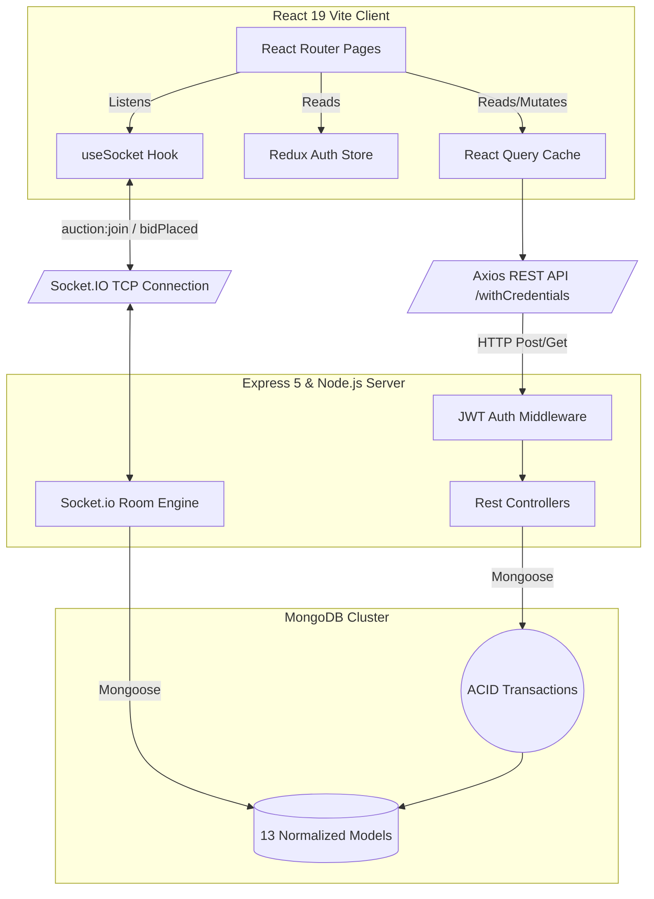
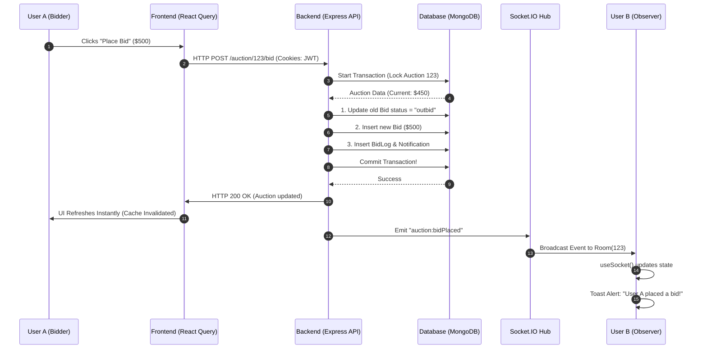

# 🔥 Full System Architecture (Client + Server)

Overview of the entire **Online Auction System**. Designed as a high-performance **MERN Stack** (MongoDB, Express, React, Node) application featuring heavy **Socket.IO** integration. 

This guide acts as the definitive roadmap for new developers navigating the data hand-offs between the React 19 Frontend and the Express 5 Backend.

---

## 🏗️ 1. High-Level System Architecture

The most critical principle of this platform is **Asynchronous Separation**. 

- The Client relies on **React Query** to seamlessly pre-cache server HTTP Responses.
- The Server leverages native **MongoDB Aggregation pipelines & TTL Indexes** to avoid loading unnecessary memory instances.
- **Socket.IO** is physically isolated to handle parallel bidding updates without choking the main HTTP REST logic.

---

## 💸 2. The Real-Time Bidding Flow (Data Journey)

The most complex path in the application. How a $10 bid becomes a confirmed database entry and reaches other users around the world.

### The Lifecycle of a Bid

1. **User Action:** The user clicks "Place Bid" in `ViewAuction.jsx`.
2. **REST Trigger:** The UI fires the `usePlaceBid` React Query mutation wrapper.
3. **Backend Intercept:** `auction.controller.js` accepts the payload and verifies the JWT HTTP-cookie to validate the bidder.
4. **Database Lock & Commit:** The Express server starts a **MongoDB ReplicaSet Transaction**. It atomically invalidates old bids, writes a new `Bid` record, writes an immutable `BidLog` audit trail, checks the 5-minute Anti-Sniping `AuctionExtension`, and commits the changes.
5. **Real-time Signal:** The Express controller signals the local Socket.IO instance to `.emit("auction:bidPlaced")` into the specific Auction ID's room.
6. **Client Resolution:** 
   - The bidder's React Query silently invalidates the old cache (`["auction", id]`), auto-refreshing their UI.
   - All *other* clients receive the Socket.IO broadcast via `useSocket.js`, updating their `liveAuction` state and showing a React Hot Toast alert.

---

## 🛡️ 3. Security & Anti-Fraud Mechanisms

To protect the integrity of the auction house:

1. **Same-Site HTTP-Only Cookies:** Tokens are impossible to read with JavaScript `document.cookie`. This physically eliminates XSS vulnerabilities.
2. **Race-Condition Invulnerability:** High-traffic auctions often see two people place a bid at the exact millisecond. The MongoDB `session.commitTransaction()` acts as a global queue, forcing one to win, and the other to hit the catch-block (returning HTTP 400).
3. **Optimistic Overtime (Anti-Sniping):** Hardcoded logic measures `msRemaining`. Any bid under the 5-minute threshold forces the auction to artificially revive itself, completely preventing bots from out-sniping human players in the final second.
4. **Self-Pruning Audit Logs:** The `login.model.js` uses native TTL parameters `expires: 15778463`. The database natively erases login histories older than 6 months.

---

## 🎯 4. Codebase Navigation Cheatsheet

If you are a new developer, start here:

- **Where is the backend logic?** Go directly to `server/controllers/auction.controller.js` to see the transaction logic, or `server/routes/analytics.routes.js` for complex MongoDB aggregations.
- **Where is the real-time server logic?** Check `server/socket/index.js` for the strict JWT-handshake protocols that allow WebSocket traffic.
- **Where is the frontend cache?** Check `client/src/hooks/useAuction.js` to see how the client intercepts events before hitting Axios.
- **Where does the Socket hit the UI?** Check `client/src/hooks/useSocket.js` where the toast integrations and presence tracking (`activeUsers`) lives.
